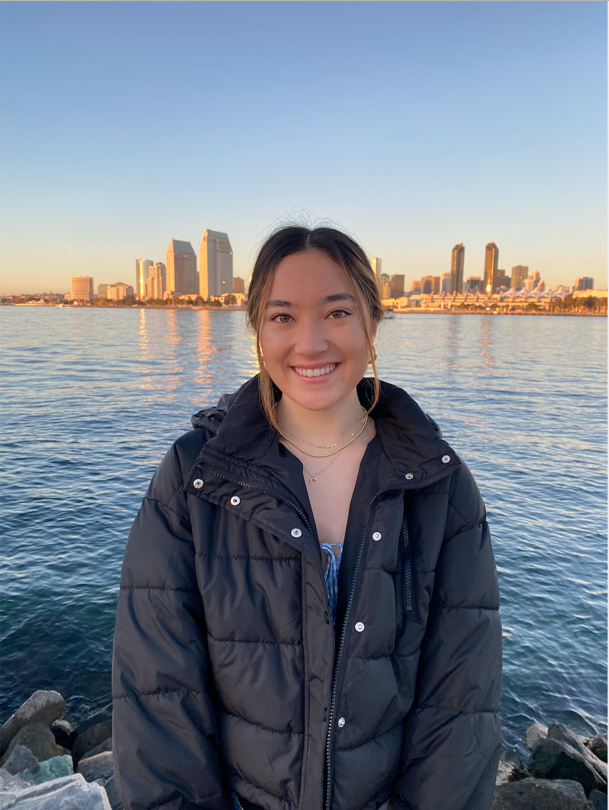
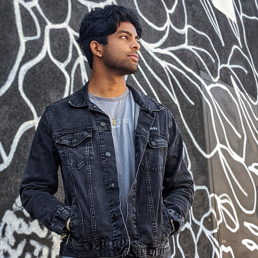
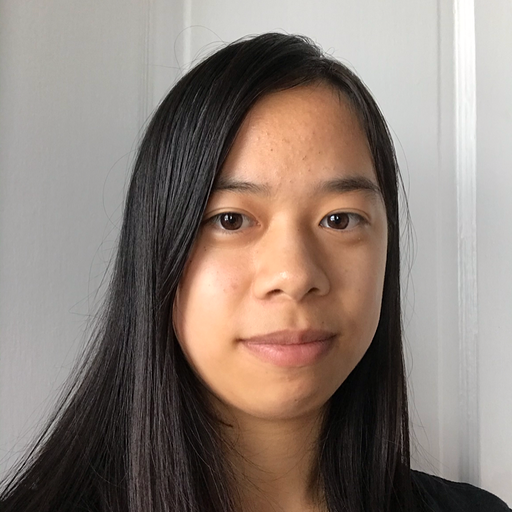

# Team Dots and Crosses

## Values

We value the growth mindset and seeing everything as an opportunity to grow. Making mistakes or doing things wrong the first time is just information that we can use to improve and does not say anything about our self-worth

We value being proactive, communicative, and reaching out. We understand that we have a responsibility towards ourselves and our team to show up and be present.

We know that things will be difficult and messy sometimes, but that is also part of the process, and an opportunity to improve.

We recognize that we can do our best work when we are physically and mentally well and we will do our best to take care of ourselves, so that we can handle the responsibilities that we've committed to.

We acknowledge that our differences make our team stronger and that we have a lot to learn from each other if we keep an open mind. We also have a lot to teach and share to each other and we do not see needing help as a sign of weakness.

We value people, first and foremost, and strive to understand the people involved at every stage of development. We will act with compassion towards each other and others around us.

## Meet the Team 

#### [Annie Dai](https://amanita19.github.io/)

#### [Finn Reid](https://stayingqold.github.io/cse110-lab1/)

#### [Blake Vonder-Haar](https://blakevonderhaar.github.io/CSE110/)

#### [Haily Duong](https://h2duong.github.io/cse110hd/)

#### [Sara Doron](https://saradoron.github.io/lab-week-1/)

Hi I'm Sara! I'm a second year Computer Science major in Muir College. I love ballet, cooking and taveling. 

#### Dhanvi Desu

#### Garrett Dungca

#### [Jamshed Ashurov](https://ashurja.github.io/CSE110-GitHubPages/)

#### [Allison Chan](https://allisonyjchan.github.io/about-me/)

Hello! I'm Allison. I use she/her/they/them and I'm a second year Computer Science major in Muir College! I'm one of the co-leads for Team Dots and Crosses! I like reading, taking walks and looking at flowers and singing really loudly in my room!
